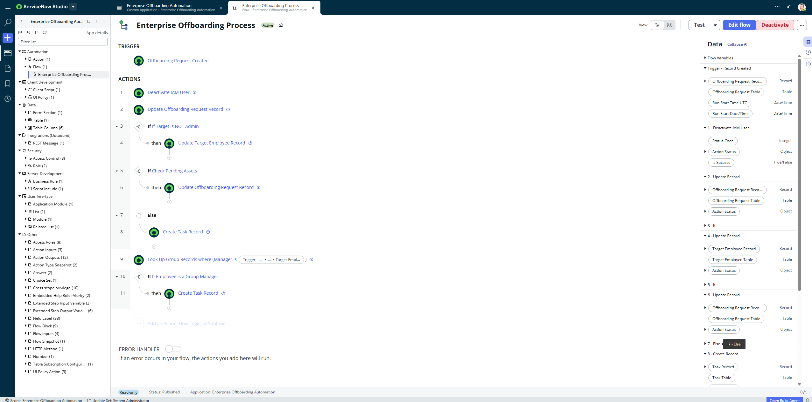
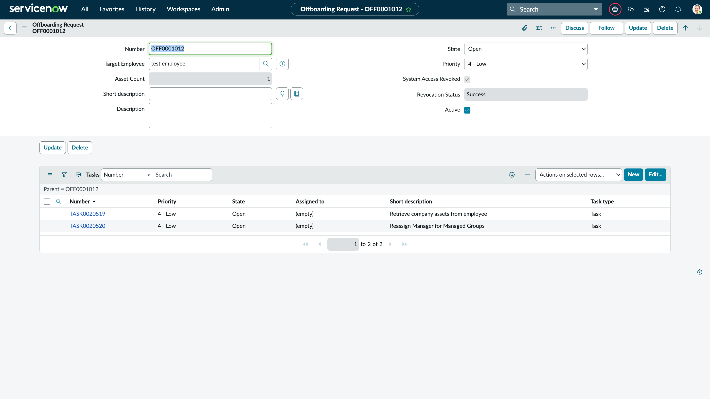

# Enterprise Offboarding Automation (ServiceNow Scoped App)

An automated IT & IAM Offboarding governance solution built on ServiceNow. This application orchestrates end-to-end access revocation, CMDB asset reclamation, and team management continuity.

---

## 📌 Problem & Business Impact
Manual offboarding processes expose enterprises to security risks, stranded hardware, and orphaned team approvals:
* **Logical Security Risks:** Delayed account deactivation leaves corporate systems vulnerable.
* **Asset Loss:** Lack of CMDB synchronization leads to unreturned hardware.
* **Orphaned Approvals:** Terminating a team manager without reassigning group ownership breaks internal approval chains.

---

## ⚙️ Architecture & Automation Logic (Flow Designer)

The core workflow triggers dynamically upon creating an offboarding request and executes three distinct streams:

```
[Trigger: Offboarding Request Created]
        │
        ├──► [IAM Deprovisioning & Security Check]
        │           ├── Target is Admin? ──► Skip Lockout (Safety Prevention)
        │           └── Target is Non-Admin ──► Update sys_user (Active: false, Locked out: true)
        │
        ├──► [CMDB Asset Recovery Check]
        │           ├── Asset Count == 0 ──► Automatically Complete Request
        │           └── Asset Count > 0 ──► Generate Sub-Task for Hardware Collection
        │
        └──► [Organizational Continuity Check]
                    └── Manages Groups in sys_user_group? ──► Generate Sub-Task for Manager Reassignment
```
### Flow Designer Implementation


## 🧪 Verification & Test Execution Proof

The workflow was validated against a target test profile to ensure deterministic fulfillment:
* **Asset Correlation:** Identified assigned hardware and locked the form field via UI Policy (`Asset Count = 1`).
* **IAM Revocation:** Deprovisioned user login permissions (`Locked out: true`, `Active: false`).
* **Task Generation:** Automatically generated two contextual child tasks for asset retrieval and group manager reassignment.



---

## 🛠️ Application Inventory & Scope Artifacts

| Artifact Category | File / Name | Description |
| :--- | :--- | :--- |
| **Custom Tables** | `x_..._offboarding_request` | Core entity tracking offboarding lifecycle metrics |
| **Flows** | `Enterprise Offboarding Process` | Main orchestration engine governing all 3 pillars |
| **UI Policies** | `Make Asset Count Read-Only` | Client-side data integrity & tampering prevention |
| **Data Targets** | `sys_user`, `alm_hardware`, `sys_user_group`, `task` | Target tables for query lookup and automation updates |

> **Note on Repository Structure:**  
> The directory `94cda6a2934b0310f7f270d19dba1012/` represents the internal ServiceNow Scoped Application `sys_id`. It is automatically generated by Studio's Source Control integration to structure and store XML application metadata.

---

## 🚀 Installation & Deployment

1. In your ServiceNow Instance, open **Studio**.
2. Select **Import from Source Control**.
3. Provide the repository URL: https://github.com/FahadFZ1/enterprise-offboarding-automation.git
4. Authenticate using your GitHub Personal Access Token (PAT).

---

## 📄 License
This project is open source and available under the [MIT License](LICENSE).
